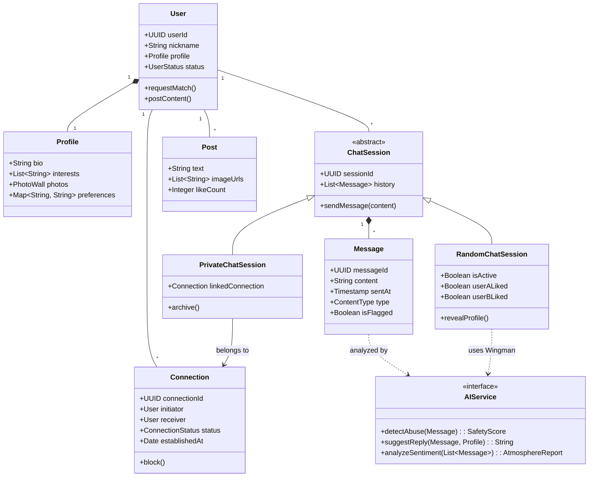

# FlirtNet Architecture Diagrams (4+1 View Model)

This document presents the architectural design for **FlirtNet** using the **4+1 View Model**. These diagrams are tailored to capture the specific logic of the "Random Chat to Long-term Connection" flow, the integrated Public Square, and the suite of AI support features (Wingman, Safety, Companion).

## 1. Scenario View (Use Case Diagram)
**Purpose:** Describes the system functionality from the user's perspective.
**Focus:** Detailed user interactions including the "Datemate" lifecycle, Public Square integration, and comprehensive AI support.

```mermaid
usecaseDiagram
    actor "User" as U
    actor "AI System" as AI

    usecase "Register/Login" as UC_Auth
    usecase "Edit Profile" as UC_EditProfile
    usecase "Manage Photo Wall" as UC_Photos

    usecase "Start Random Match" as UC_Match
    usecase "Chat with Stranger" as UC_ChatRandom
    usecase "View Stranger Profile" as UC_ViewProfile
    usecase "Send Friend Request" as UC_SendReq_Match

    usecase "Accept/Reject Request" as UC_HandleReq
    usecase "Private Chat (Datemate)" as UC_ChatPrivate


    usecase "Publish Post" as UC_Post
    usecase "Comment/Like" as UC_Interact
    usecase "Send Friend Request (from Post)" as UC_SendReq_Post

    usecase "Chat with AI Companion" as UC_AI_Companion
    usecase "Chat with 'Miss Ex'" as UC_AI_Ex
    usecase "AI Practice Mode" as UC_AI_Practice
    usecase "Get Wingman Advice" as UC_AI_Wingman
    usecase "Analyze Atmosphere" as UC_AI_Atmosphere
    usecase "Optimize Profile" as UC_AI_Profile
    usecase "Detect Abuse" as UC_AI_Safety

    %% User Management
    U --> UC_Auth
    U --> UC_EditProfile
    U --> UC_Photos
    UC_EditProfile ..> UC_AI_Profile : <<extend>>

    %% Discovery
    U --> UC_Match
    UC_Match ..> UC_ChatRandom : <<include>>
    UC_ChatRandom ..> UC_ViewProfile : <<include>>
    UC_ChatRandom ..> UC_SendReq_Match : <<extend>>
    
    %% AI Companion Fallback
    UC_Match ..> UC_AI_Companion : <<extend>>

    %% Connection
    U --> UC_HandleReq
    U --> UC_ChatPrivate

    UC_SendReq_Match --> UC_HandleReq : Triggers
    UC_SendReq_Post --> UC_HandleReq : Triggers

    %% Public Square
    U --> UC_Post
    U --> UC_Interact
    UC_Interact ..> UC_SendReq_Post : <<extend>>

    %% AI Integrations in Chat
    UC_ChatRandom ..> UC_AI_Wingman : <<extend>>
    UC_ChatRandom ..> UC_AI_Atmosphere : <<include>>
    UC_ChatRandom ..> UC_AI_Safety : <<include>>
    UC_ChatPrivate ..> UC_AI_Safety : <<include>>
    UC_Post ..> UC_AI_Safety : <<include>>

    %% Standalone AI Features
    U --> UC_AI_Ex
    U --> UC_AI_Practice

    %% AI Actor Relationships
    AI --> UC_AI_Companion
    AI --> UC_AI_Ex
    AI --> UC_AI_Practice
    AI --> UC_AI_Wingman
    AI --> UC_AI_Atmosphere
    AI --> UC_AI_Profile
    AI --> UC_AI_Safety
```

## 2. Logical View (Class Diagram)
**Purpose:** Shows the static structure and relationships of the system's entities.
**Focus:** The distinction between `RandomSession` and `Connection`, and how `AIService` interfaces with them.



## 3. Development View (Component Diagram)
**Purpose:** Describes the organization of software modules and dependencies.
**Focus:** Breaking down the "AI Engine" into specific functional modules like Safety, Matching, and Bot.

```mermaid
componentDiagram
    package "Client App" {
        [UI Frontend] as UI
        [State Manager] as State
    }

    package "API Gateway" {
        [REST API] as REST
        [WebSocket Server] as WS
    }

    package "Core Services" {
        [User Service] as UserSvc
        [Matchmaking Service] as MatchSvc
        [Chat Service] as ChatSvc
        [Social Service] as SocialSvc
        [Notification Service] as NotifSvc
    }

    package "AI Engine" {
        [NLP Processor] as NLP
        [Safety/Abuse Detector] as Safety
        [Wingman Generator] as Wingman
        [AI Companion Bot] as Bot
    }

    package "Data Persistence" {
        [Relational DB (User/Conn)] as RDBMS
        [NoSQL DB (Chat Logs)] as NoSQL
        [Vector DB (Matching)] as VectorDB
    }

    UI --> REST : HTTP
    UI --> WS : Real-time Events
    
    REST --> UserSvc
    REST --> SocialSvc
    WS --> ChatSvc
    WS --> MatchSvc

    MatchSvc --> VectorDB : finds similar users
    MatchSvc --> Bot : fallback to AI
    
    ChatSvc --> NLP : analyzes context
    ChatSvc --> Safety : filters content
    ChatSvc --> Wingman : requests tips
    ChatSvc --> NoSQL : stores history
    
    SocialSvc --> Safety : moderates posts
    SocialSvc --> RDBMS
```

## 4. Process View (Activity Diagram)
**Purpose:** Illustrates the dynamic flow of the system's core value proposition.
**Focus:** The detailed workflow of a Random Chat session, including AI intervention and the "Moment of Truth" (Connection).

```mermaid
activityDiagram-v2
    title Core Flow: Random Chat & AI Safety

    start
    :User requests Random Match;
    
    if (Real User Available?) then (yes)
        :Match with User B;
    else (no)
        :Offer AI Companion;
        if (Accept?) then (yes)
            :Start Chat with AI Bot;
            stop
        else (no)
            :Wait in Queue;
        endif
    endif

    :Start Random Chat Session;
    
    repeat
        :User types message;
        
        partition "AI Safety Check" {
            :Analyze Content;
            if (Is Abusive/Harmful?) then (yes)
                :Block Message;
                :Warn User;
                stop
            else (no)
                :Forward Message;
            endif
        }

        fork
            :Recipient reads message;
        fork again
            if (User requests Wingman?) then (yes)
                :AI analyzes context;
                :Suggest reply;
            endif
        end fork
        
        :Update Atmosphere Score;
    
    repeat while (Session Active)

    if (User sends Datemate Request?) then (yes)
        :Reveal Full Profiles;
        if (Other User Accepts?) then (yes)
            :Establish Datemate Relation;
            :Move to Datemate List;
        else (no)
            :Disconnect;
        endif
    else (no)
        :Disconnect;
    endif
    stop
```

## 5. Physical View (Deployment Diagram)
**Purpose:** Shows the mapping of software to hardware.
**Focus:** Highlighting the separate AI processing infrastructure and real-time communication channels.

```mermaid
deploymentDiagram
    node "Client Device" {
        [Mobile/Web App]
    }

    node "Cloud Region" {
        node "Load Balancer" as LB
        
        node "Kubernetes Cluster" {
            component "API Gateway"
            component "Chat Service (WebSocket)"
            component "Core Services"
        }
        
        node "AI Inference Cluster" {
            [LLM Service (Wingman/Bot)]
            [Content Moderator Model]
        }
        
        node "Data Layer" {
            database "PostgreSQL (Users)"
            database "Redis (Pub/Sub & Cache)"
            database "MongoDB (Chat History)"
        }
    }

    [Mobile/Web App] -- LB : HTTPS / WSS
    LB -- [API Gateway]
    [API Gateway] -- [Chat Service (WebSocket)]
    [Chat Service (WebSocket)] -- [Redis (Pub/Sub & Cache)] : Fast Msg Broker
    [Chat Service (WebSocket)] -- [LLM Service (Wingman/Bot)] : Async Inference
    [Core Services] -- [PostgreSQL (Users)]
    [Chat Service (WebSocket)] -- [MongoDB (Chat History)]
```
